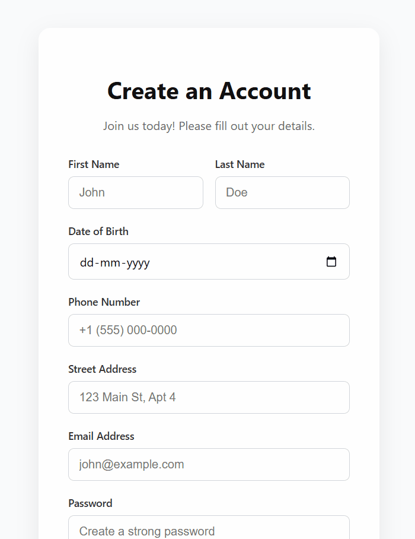
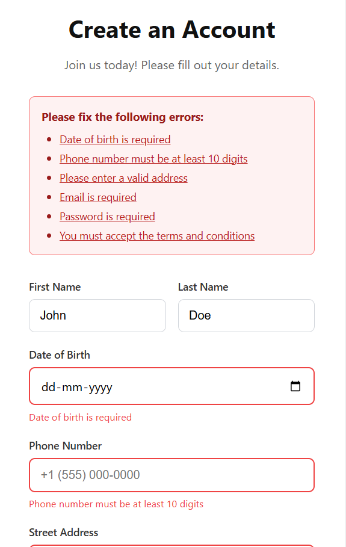

# react-form-ux

Fix common React form UX problems in seconds.

`react-form-ux` is a lightweight utility library that improves the **user experience of React forms** by handling common UX tasks like:

- focusing the first invalid field
- scrolling to validation errors
- generating accessible error summaries

The library is **headless and framework-agnostic**, so it works with any React form solution.

---

## Demo

Submitting an invalid form automatically scrolls to the first error and focuses the field.



---

## Example



## ✨ Features

- Focus the **first invalid input automatically**
- Scroll to validation errors in long forms
- Generate **accessible error summaries**
- Works seamlessly with **React Hook Form, Formik, Zod, or custom forms**
- Tiny bundle size
- Headless API (bring your own UI)

---

## 📦 Installation

```bash
npm install react-form-ux
```
```bash
yarn add react-form-ux
```
```bash
pnpm add react-form-ux
```

---

## 🛠 Usage

Basic usage with any form library is extremely simple. `react-form-ux` only requires a standard JavaScript object where the keys correspond to your input `name` attributes, and the values are the error objects.

```javascript
import { useFormUX } from "react-form-ux";

// 1. Pass in your form state errors
const { focusFirstError, scrollToError } = useFormUX({
  errors,
});

// 2. Call them in your form submission handler!
const onError = () => {
    // We recommend a tiny timeout so React has time to paint 
    // any new error summary elements to the DOM first!
    setTimeout(() => {
        scrollToError();
        focusFirstError();
    }, 100);
}
```

### Available API Helpers:

| Function          | Description                                   |
| ----------------- | --------------------------------------------- |
| `focusFirstError()` | Focus the first invalid input field           |
| `scrollToError()`   | Scroll smoothly to the first validation error |
| `getErrorFields()`  | Get an array of field names with validation errors|

---

## 🔗 Example with React Hook Form & Zod

`react-form-ux` is built perfectly for modern validation pipelines like Zod integrated with React Hook Form via `@hookform/resolvers/zod`. It traverses standard error schemas natively.

```jsx
import { useForm } from "react-hook-form";
import { useFormUX, ErrorSummary } from "react-form-ux";
import { zodResolver } from "@hookform/resolvers/zod";
import * as z from "zod";

const schema = z.object({
  email: z.string().email("Invalid email address"),
});

export default function SignupForm() {
  const { register, handleSubmit, formState: { errors } } = useForm({
    resolver: zodResolver(schema),
  });

  const { focusFirstError, scrollToError } = useFormUX({ errors });

  const onSubmit = (data) => console.log(data);

  const onError = () => {
    // Let React render the error spans before scrolling to them
    setTimeout(() => {
      scrollToError();
      focusFirstError();
    }, 100);
  };

  return (
    <form onSubmit={handleSubmit(onSubmit, onError)}>
      {/* Optional: Render an accessible summary block at the top */}
      <ErrorSummary errors={errors} />

      <input {...register("email")} />
      {errors.email && <span className="error">{errors.email.message}</span>}

      <button type="submit">Submit</button>
    </form>
  );
}
```

---

## 🧠 The Problem (Why does this exist?)

Most React form libraries focus entirely on **form state and validation**, but developers still need to manually write imperative layout behaviors to fix the UX:

- focusing the first invalid input after submit
- scrolling long forms up to the first hidden error
- extracting error paths into accessible summary blocks

Example of common ad-hoc code developers must write repeatedly:
```javascript
const firstError = document.querySelector("[aria-invalid='true']");
firstError?.focus();
```

`react-form-ux` provides exactly these **reusable UX primitives** so you never have to write that brittle DOM-querying logic again.

---

## ⚙️ Compatibility

`react-form-ux` works with:

- React 18+
- React Hook Form
- Formik
- Custom React forms

The library does not depend on any specific form framework.

---

## 🚧 Status

Early development.

Current features:

- `focusFirstError`
- `scrollToError`
- `getErrorFields`
- `ErrorSummary` component

More improvements coming soon.

---

## 📜 License

MIT License

---

## 🤝 Contributing

Contributions and ideas are welcome.

If you find a bug or have a feature suggestion, please open an issue.